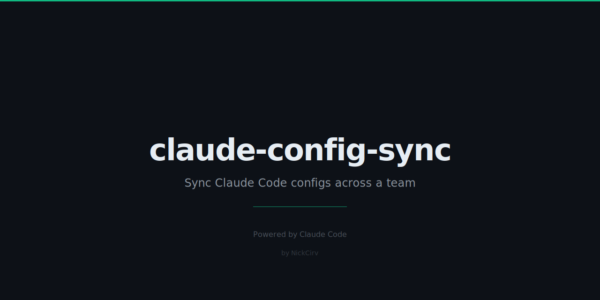

# claude-config-sync



Sync Claude Code configs across a team. One shared git repo = single source of truth for rules, hooks, and settings.

## What it syncs

| File / Path | How |
|---|---|
| `.claude/rules/*.md` | Copied directly (team-wide rules) |
| `.claude/settings.json` | Smart merged — shared keys added, local keys kept |
| `CLAUDE.md` | Copied if shared version exists |

## Quick start

```bash
# 1. Create a shared config repo (once per team)
git init my-claude-configs && cd my-claude-configs
git remote add origin git@github.com:your-org/claude-configs.git

# 2. In each project, link to the shared repo
npx claude-config-sync init git@github.com:your-org/claude-configs.git

# 3. Pull shared configs in
npx claude-config-sync pull

# 4. After editing local configs, push them back
npx claude-config-sync push
```

## Commands

### `init <repo-url>`

Link this project to a shared config repo. Creates `.claude-sync.json`.

```bash
npx claude-config-sync init git@github.com:your-org/claude-configs.git
npx claude-config-sync init https://github.com/your-org/claude-configs.git --branch dev
```

Options:
- `-b, --branch <branch>` — branch to use (default: `main`)

### `pull`

Pull the latest configs from the shared repo into this project.

```bash
npx claude-config-sync pull
```

- Rules files are copied verbatim.
- `settings.json` is **smart merged**: shared keys are added to local, existing local keys are never overwritten.

### `push`

Push your local config changes to the shared repo.

```bash
npx claude-config-sync push
npx claude-config-sync push --message "add rate-limit rule"
```

Options:
- `-m, --message <msg>` — custom commit message

### `diff`

Show exactly what differs between local and shared repo.

```bash
npx claude-config-sync diff
```

Output uses `+` (local only), `-` (shared only), `~` (modified), `=` (identical).

### `status`

Check whether you're up-to-date, behind, ahead, or diverged.

```bash
npx claude-config-sync status
```

## Configuration (`.claude-sync.json`)

Created by `init`. Safe to commit if you want all team members to point to the same repo automatically.

```json
{
  "repo": "git@github.com:your-org/claude-configs.git",
  "branch": "main",
  "lastSync": "2026-02-27T10:00:00.000Z",
  "syncPaths": [
    ".claude/rules",
    ".claude/settings.json",
    "CLAUDE.md"
  ],
  "mergeSettings": true
}
```

| Key | Description |
|---|---|
| `repo` | Git URL of the shared config repo |
| `branch` | Branch to sync against |
| `lastSync` | ISO timestamp of the last successful sync |
| `syncPaths` | Files/directories to sync |
| `mergeSettings` | If `true`, `settings.json` is merged rather than overwritten |

## Smart merge for `settings.json`

The merge strategy ensures no developer loses personal overrides:

- **Shared-only keys** → added to local
- **Local-only keys** → kept as-is
- **Both have the key** → local value wins
- **Arrays** → unioned (deduplicated), not replaced

This means a team can add new `hooks` or `allowedTools` without clobbering individual preferences.

## How it works

1. Shared configs live in a normal git repo your team creates.
2. `.claude-sync.json` in each project points to that repo + branch.
3. `pull` clones/fetches the shared repo to a temp directory, then copies files.
4. `push` copies local files into the shared clone, commits, and pushes.
5. No API keys, no servers — just git.

## Requirements

- Node.js >= 18
- `git` on PATH (any version that supports `clone --single-branch`)

## License

MIT
